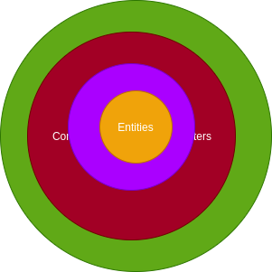

# Problem Statement

Write a program that lets two players play tic-tac-toe against each other. Here's the sequence of things that happen when the program executes:
1. Program starts, prints out an empty grid.
1. The program then prompts for Player 1 name, followed by their preferred symbol; assigns a default 'X'.
1. Same for Player 2 name, followed by their preferred symbol; assigns a default 'O'.
1. Players take turns making their move. If a step is illegal or invalid, the program prints out the error and asks them to enter again.
1. The game continues until it's over, when the game is over, it announces the result.

## Build

You need Java 8 installed on machine.

On windows
 
    gradlew.bat clean jar
On linux
 
    gradlew clean jar

## Run

    java -jar build/libs/tic-tac-toe-1.0-SNAPSHOT.jar 

## Implementation
Based on OOPS/GRASP principals below could be classes

Nouns

    Players:
            name
            preferred-symbol: (X : 0)
        play,taketurn,move     
    Game : tic-tac-toe
      has 
        Grid:
           empty
    
    
    
## Testing

Horizontal and Vertical cases are passing.
Only 3x3 grid has been tests
Only square grid is know to be working

## TODO

1. Test for rectangle grid
1. Segregate entity from use cases
1. Potential expose REST api
1. Test more dimensions of grid
1. Test more than 2 players
